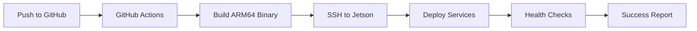

# 🏭 Coding Factory - OpenClaw Development Workflow

## Overview

The **Coding Factory** is a professional software development environment where OpenClaw AI Assistant operates as a productive engineer with full GitHub capabilities. This system enables autonomous development, code review, documentation, and deployment with enterprise-grade practices.

## 🎯 Mission

Transform OpenClaw into a professional software engineer that can:
- Write production-ready code
- Manage version control professionally
- Maintain comprehensive documentation
- Follow security best practices
- Implement automated testing
- Deploy with CI/CD pipelines
- Collaborate through GitHub

## 🏗️ Architecture

```
┌─────────────────────────────────────────────────────────────┐
│                    Coding Factory Ecosystem                 │
├─────────────────────────────────────────────────────────────┤
│                                                               │
│  ┌──────────────┐      ┌──────────────┐      ┌───────────┐ │
│  │   MacBook    │◄────►│   GitHub     │◄────►│   Jetson  │ │
│  │  (Primary)   │      │  (Central)   │      │  (AI Dev) │ │
│  └──────────────┘      └──────────────┘      └───────────┘ │
│         │                      │                     │        │
│         │                      │                     │        │
│    Human               CI/CD & Code             OpenClaw    │
│   Developer             Collaboration            AI Agent    │
│                                                               │
└─────────────────────────────────────────────────────────────┘
```

## 🔄 Workflow

### 1. Development Phase

**MacBook (Human Developer)**
```bash
cd ~/Sites/jetson-openclaw-setup/
git pull origin main                    # Sync latest
# ... make changes ...
git add .
git commit -m "feat: new feature"
git push origin main                    # Push to GitHub
```

**Jetson (OpenClaw AI)**
```bash
cd ~/openclaw-repo/
git pull origin main                    # Sync from GitHub
# OpenClaw reads AGENTS.md and skills
# ... autonomous development ...
git add .
git commit -m "feat: AI-implemented feature"
git push origin main                    # Push back to GitHub
```

### 2. Automated Deployment



**Trigger**: Any push to `main` branch

**Process**:
1. GitHub Actions detects push
2. Builds ARM64 binaries for:
   - brain-server
   - signal-gateway
3. Uploads to Jetson via SSH
4. Restarts systemd services
5. Runs health checks
6. Reports deployment status

### 3. Continuous Development Loop

```
┌──────────────────────────────────────────────────────────┐
│                                                           │
│   ┌─────────┐    ┌─────────┐    ┌─────────┐             │
│   │ Plan    │───►│ Code    │───►│ Test    │             │
│   └─────────┘    └─────────┘    └─────────┘             │
│        │              │              │                    │
│        ▼              ▼              ▼                    │
│   ┌─────────┐    ┌─────────┐    ┌─────────┐             │
│   │ Issues  │    │ Commits │    │ Deploy  │             │
│   └─────────┘    └─────────┘    └─────────┘             │
│        │              │              │                    │
│        └──────────────┴──────────────┘                    │
│                       │                                    │
│                       ▼                                    │
│              ┌──────────────┐                             │
│              │  GitHub PR   │                             │
│              └──────────────┘                             │
│                                                           │
└──────────────────────────────────────────────────────────┘
```

## 🛠️ OpenClaw Capabilities

### GitHub Skill

OpenClaw has comprehensive Git/GitHub knowledge via the **GitHub Skill**:

**Core Operations**:
- ✅ Git workflow (clone, commit, push, pull, branch)
- ✅ Commit message standards (Conventional Commits)
- ✅ Branch management (feature branches, hotfixes)
- ✅ Conflict resolution
- ✅ Repository management
- ✅ Documentation generation

**Security Practices**:
- ✅ SSH key authentication
- ✅ IP restrictions (only MacBook can connect)
- ✅ No secrets in code
- ✅ Secure commit practices

**Quality Standards**:
- ✅ Semantic versioning
- ✅ Testing requirements
- ✅ Documentation standards
- ✅ Code review process

### Development Workflow

**1. Planning**
```bash
# OpenClaw can:
- Read issues from GitHub
- Understand feature requirements
- Propose implementation plans
- Create feature branches
```

**2. Development**
```bash
# OpenClaw can:
- Write production code
- Follow language best practices
- Add comprehensive comments
- Write unit tests
- Update documentation
```

**3. Quality Assurance**
```bash
# OpenClaw can:
- Run automated tests
- Perform code reviews
- Check security issues
- Validate documentation
- Ensure standards compliance
```

**4. Deployment**
```bash
# OpenClaw can:
- Update version numbers
- Create release tags
- Generate CHANGELOG
- Push to GitHub
- Trigger CI/CD deployment
```

## 📋 Best Practices

### 1. Atomic Commits

```bash
# ✅ Good: One logical change
git add services/signal-gateway/src/webhook.rs
git commit -m "feat: add webhook POST endpoint"

# ❌ Bad: Giant commit
git add .
git commit -m "lots of changes"
```

### 2. Conventional Commits

```
<type>[optional scope]: <description>

[optional body]

[optional footer]
```

**Types**:
- `feat`: New feature
- `fix`: Bug fix
- `docs`: Documentation
- `style`: Code style
- `refactor`: Refactoring
- `test`: Tests
- `chore`: Maintenance
- `ci`: CI/CD

### 3. Branch Strategy

```
main (protected)
├── feature/webhook-support
├── feature/brain-api-v2
├── fix/memory-leak
└── hotfix/urgent-security-fix
```

### 4. Frequent Synchronization

```bash
# Always pull before starting work
git pull origin main

# Push feature branches frequently
git push origin feature-name

# Merge to main only after review
git checkout main
git merge feature-name
git push origin main
```

## 🔒 Security Measures

### Implemented

- ✅ SSH key authentication (no passwords)
- ✅ IP restrictions on authorized_keys
- ✅ GPG signing capability (optional)
- ✅ No secrets in repository
- ✅ .gitignore for sensitive files

### Guidelines

```bash
# Never commit:
- SSH keys (*.pem, *.key, id_*)
- Database files (*.db, *.db-shm, *.db-wal)
- Credentials (passwords, tokens, API keys)
- Environment variables with secrets
- Private documentation

# Always check:
git diff --cached | grep -i "password\|secret\|api_key\|token"
```

## 📚 Documentation Standards

### Required Documentation

Every project must have:

**1. README.md**
```markdown
# Project Name

## Quick Start
## Installation
## Configuration
## API Reference
## Development
## Testing
## Deployment
## Troubleshooting
## Changelog
```

**2. CHANGELOG.md**
```markdown
# Changelog

## [Unreleased]

## [1.0.0] - 2024-02-24
### Added
- Initial release
```

**3. API Documentation**
- OpenAPI/Swagger specs (for HTTP APIs)
- Inline code comments
- Usage examples
- Error documentation

### Documentation Maintenance

OpenClaw automatically:
- Updates README.md when adding features
- Maintains CHANGELOG.md
- Generates API docs
- Creates architecture diagrams
- Writes troubleshooting guides

## 🧪 Testing Standards

### Pre-commit Testing

```bash
# Rust services
cargo test
cargo clippy

# Python scripts
pytest tests/

# Shell scripts
shellcheck script.sh

# Go to main directory
cd ~/openclaw-repo/
```

### Test Coverage

- Unit tests for critical functions
- Integration tests for APIs
- End-to-end tests for workflows
- Performance tests for bottlenecks

## 🚀 Deployment Automation

### GitHub Actions CI/CD

**Auto-Deploy Workflow** (already configured):

```yaml
name: Auto Deploy to Jetson
on:
  push:
    branches: [main]
```

**Process**:
1. Detects push to main
2. Builds ARM64 binaries
3. Uploads to Jetson
4. Restarts services
5. Runs health checks
6. Reports status

### Manual Deployment

```bash
# From MacBook
cd ~/Sites/jetson-openclaw-setup/
git push origin main

# From Jetson
cd ~/openclaw-repo/
git pull origin main
# Services auto-restart
```

## 📊 Quality Metrics

### Code Quality

- **Test Coverage**: >80%
- **Documentation**: 100% for public APIs
- **Code Review**: Required for main branch
- **Static Analysis**: No warnings

### Performance

- **Response Time**: <100ms for APIs
- **Memory Usage**: <512MB for services
- **Uptime**: >99.9%

### Security

- **Vulnerability Scanning**: Automated
- **Dependency Updates**: Weekly
- **Security Audits**: Monthly

## 🎓 Learning Resources

### OpenClaw Skills

1. **GitHub Skill** - Version control and GitHub operations
2. **Prompt Guard** - Security and validation
3. **ZeroClaw** - Lightweight AI tasks

### Documentation

- `docs/CODING_FACTORY.md` - This file
- `.openclaw-workspace-backup/skills/github/SKILL.md` - GitHub reference
- `AGENTS.md` - OpenClaw capabilities
- `README.md` - Project overview

### Quick Reference

**Daily Commands**:
```bash
# Sync
git pull origin main

# Branch
git checkout -b feature/new-feature

# Commit
git add .
git commit -m "type: description"

# Push
git push origin main
```

**Troubleshooting**:
```bash
# Check status
git status

# View log
git log --oneline -10

# Resolve conflict
git pull origin main --rebase
```

## 🎯 Success Criteria

### Code Quality

- ✅ Follows language best practices
- ✅ Passes all tests
- ✅ Well-documented
- ✅ Secure (no vulnerabilities)
- ✅ Performant (meets SLA)

### Process Compliance

- ✅ Conventional commits
- ✅ Atomic changes
- ✅ Feature branches
- ✅ Code review
- ✅ Documentation updated

### Deployment Success

- ✅ CI/CD passes
- ✅ Health checks pass
- ✅ No rollbacks needed
- ✅ Monitoring shows normal

## 🚀 Next Steps

### Immediate

1. ✅ GitHub skill installed
2. ✅ CI/CD configured
3. ✅ Security hardening complete
4. ✅ Documentation standards set

### Future Enhancements

- [ ] Automated testing in CI/CD
- [ ] Pre-commit hooks for quality
- [ ] Branch protection rules
- [ ] Automated security scanning
- [ ] Performance monitoring
- [ ] Automated backups

## 📞 Support

### Documentation

- `README.md` - Project overview
- `CHANGELOG.md` - Version history
- `docs/` - Detailed documentation
- `.openclaw-workspace-backup/skills/` - Skill references

### Troubleshooting

If OpenClaw encounters issues:

1. Check `git status`
2. Review recent commits
3. Consult GitHub skill
4. Check service logs
5. Review AGENTS.md

---

## 🎉 Summary

The **Coding Factory** transforms OpenClaw into a professional software engineer with:

- ✅ **Full GitHub Integration**: Version control, collaboration, CI/CD
- ✅ **Security First**: SSH keys, IP restrictions, secure practices
- ✅ **Quality Standards**: Testing, documentation, code review
- ✅ **Automated Deployment**: Push to deploy with health checks
- ✅ **Professional Workflow**: Feature branches, code review, releases

OpenClaw is now ready to operate as a productive software engineer in a professional development environment! 🏭✨

---

**Remember**: OpenClaw operates as a professional engineer. Follow these standards, maintain documentation, test thoroughly, and deploy confidently! 🚀